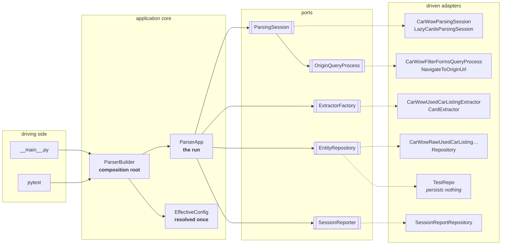
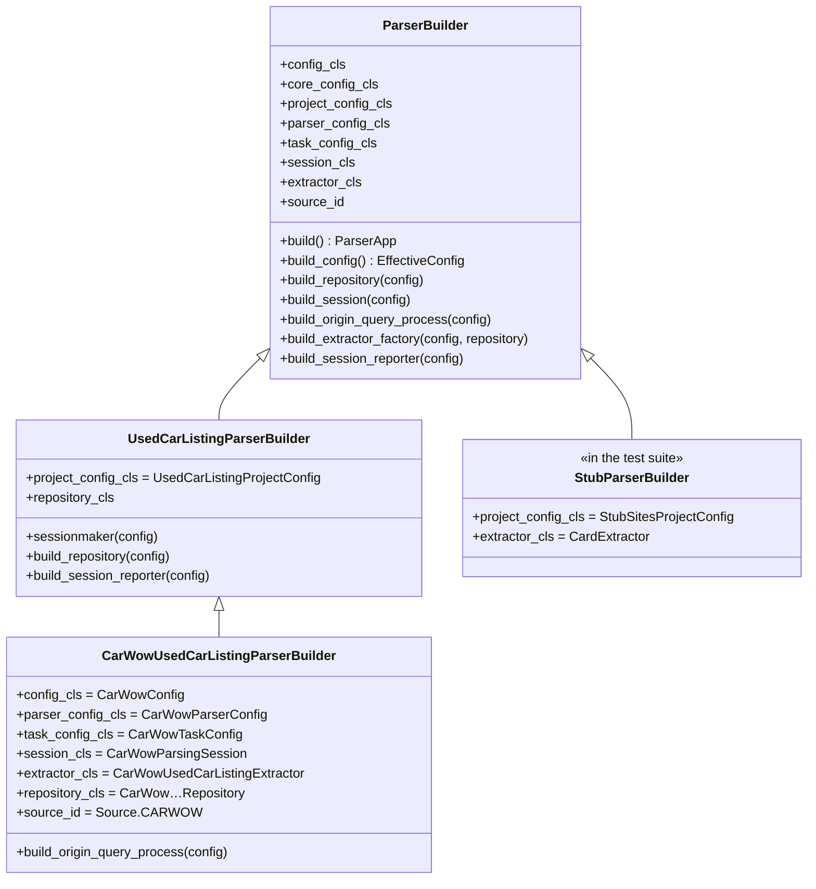
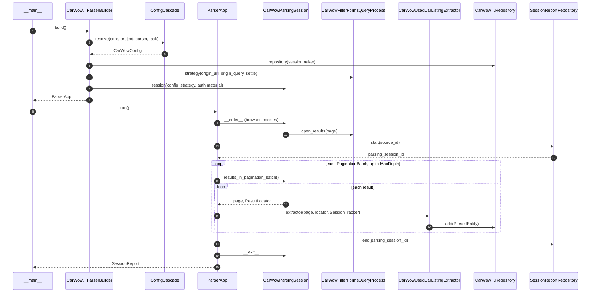
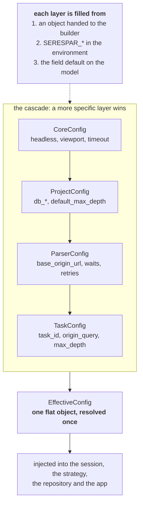

# Dependency Injection and Configuration

How a parsing application is put together: what depends on what, who decides
it, and where the configuration comes from.

This is the proposal for
[work item #3](https://gitlab.com/aciliketcap-agentic-dev/seresta/-/work_items/3).
It is also implemented -- every class named here exists and the suite runs on
it -- so the design and the code can be reviewed against each other, and the
document is what changes first if the design does. The vocabulary is the one in
[glossary.md](glossary.md); this document is about the wiring.

---

## 1. The shape of the thing

serespar is a library for driving a browser through search results. A *parsing
application* is one library plus one site plus one task: carwow's session,
carwow's extractor, this task's postcode and price range, and the database the
listings end up in. Assembling that is what this document is about.

We are following hexagonal architecture (ports and adapters), so the pieces
sort into three rings:

* the **domain** -- `ParsedEntity` and its subclasses, `OriginQuery`, `Source`,
  `SessionTracker`, the config models. Pure data and rules, no I/O.
* the **application** -- `ParserApp`. One use case: walk the pagination
  batches, extract every result, hand each one to the repository, count what
  failed. It talks to the outside only through ports.
* the **adapters** -- Playwright sessions, SQLAlchemy repositories, the
  filter-filling query process, a test repository that keeps everything in a
  list.



Solid arrows are "uses"; dashed arrows are "is implemented by". Every arrow
points inwards or sideways: no adapter is imported by the application, and the
only module that imports adapters *and* the application is the builder.

---

## 2. What we chose, and what we did not

**Decision: a hand-written composition root -- one `ParserBuilder` subclass per
application -- with constructor injection. No DI container, no auto-wiring, no
new dependency.**

The options, and why they lost:

| Option | What it buys | Why not (here) |
| --- | --- | --- |
| **Imports as wiring** (what we had): each `__main__.py` constructs everything inline | Nothing to learn | It was already the problem: the same loop copied four times, drifting; nothing testable without a database |
| **Composition root by hand** (chosen) | Explicit, typed, greppable; a type checker sees every constructor call; nothing to install | Some wiring code per parser -- which is exactly where a parser's decisions belong |
| **`dependency-injector`** (declarative containers, `Provide[...]` markers, `@inject`) | Mature, fast, config providers | A container, a registration DSL and decorators at every injection site, to resolve an object graph of five nodes built once per process |
| **Auto-wiring containers** (`lagom`, `wireup`, `punq`, `injex`) | Type-based auto-wiring, near-zero registration | The wiring stops being visible; constructor changes fail at runtime instead of at the call site; our graph is too small to pay for it |
| **`svcs`-style service locator** | Late binding, lifecycle/cleanup | Lookups spread into the code they serve, which is the thing we are trying to stop |

The reasoning follows the usual advice: start with manual wiring in one place
and reach for a container only when the graph makes it painful -- typically
tens of services, deep chains, or many entry points
([ArjanCodes](https://arjancodes.com/blog/python-dependency-injection-best-practices/),
[Seemann on Pure DI vs containers](https://blog.ploeh.dk/2012/11/06/WhentouseaDIContainer/)).
*Architecture Patterns with Python* reaches the same place for a codebase
shaped like this one -- repositories, a unit of work, adapters swapped for
fakes in tests -- and recommends a bootstrap script that wires everything and
hands back a ready object, with frameworks reserved for "dependency chains"
([cosmicpython, ch. 13](https://www.cosmicpython.com/book/chapter_13_dependency_injection.html)).
Hexagonal write-ups land in the same spot: services take `Protocol`s, and one
place at the edge decides which adapter each one gets
([ports and adapters in Python](https://dev.to/elpic/hexagonal-architecture-in-python-wiring-adapters-dependency-injection-and-the-application-layer-61l)).
Even the service-locator library's own documentation frames the good use as
"look things up **at the composition root** and inject them into the layer
below" ([svcs](https://svcs.hynek.me/en/stable/why.html)).

If the graph does grow, none of this is wasted: a container can be slotted in
*inside* `ParserBuilder.build()`, because nothing outside it knows how the
wiring happens.

**Ports are `typing.Protocol`s, not base classes.** Structural typing means an
adapter satisfies a port by having the right methods -- the SQLAlchemy
repositories written months ago satisfy `EntityRepository` without being
touched, and so does a fake defined inside a test module. `BaseExtractor` and
`AbstractBaseRepository` stay ABCs, because they also hand subclasses shared
behaviour; that is the split the typing community recommends -- protocols at
the boundary, ABCs where implementation is shared
([typing docs](https://typing.python.org/en/latest/reference/protocols.html)).

---

## 3. The mechanism

### `ParserBuilder` -- the composition root

One class, subclassed once per application. Class attributes declare *which
classes*; `build_*` hooks handle anything that needs logic.



The three levels are the config cascade seen from the assembly side: serespar
knows how to build *any* application, the project knows what every parser of
its Domain shares (one engine, one schema, the `source` seed, the
`parsing_session` row), and the parser knows what makes it itself.

### `ParserApp` -- the run



`run()` is the whole thing. `run_pagination_batches()` is the same loop as a
generator, yielding after each batch, for a caller that wants to act in
between -- which is how the integration test closes off a batch in its
repository without reimplementing the loop.

### The rules that keep it honest

1. **One composition root per entry point.** `ParserBuilder.build()` is the
   only place that decides what is wired to what.
2. **Only the composition root reads the environment.** Everything else is
   handed what it needs. A component that reaches for config at the point of
   use is a service locator wearing a hat.
3. **Constructor injection.** No setters, no globals, no module-level
   singletons, no `@cache`d accessor pretending to be a constant.
4. **Ports point inwards.** `serespar/ports.py` imports nothing from an
   adapter, and no adapter is imported by `app.py`.
5. **The config is resolved once, up front, and injected as one object.**

---

## 4. Configuration

The cascade already existed; it is now driven from one place. Four layers, most
general first, flattened into one `EffectiveConfig` before anything is built.



* **A more specific layer wins.** A value explicitly set on a layer, or a
  default a layer's own subclass declares, overrides the layers below it. A
  default merely inherited only fills a gap. So carwow's
  `default_max_depth = 80` beats the project's 10, while `SERESPAR_MAX_DEPTH`
  beats both.
* **A parser's own fields stay typed.** `CarWowConfig` mixes carwow's layers
  into `EffectiveConfig`, so `config.origin_query.postcode` and
  `config.result_sync_timeout_ms` are real attributes, not dictionary lookups.
* **The environment is one source, not the mechanism.** The test suite passes
  layer objects straight to the builder and reads no variables at all.
* **`OriginQuery` comes from the config.** `CarWowOriginQuery` is a model
  nested in the task layer, so a run's postcode, price range, ages, fuel types
  and gearbox arrive as `SERESPAR_ORIGIN_QUERY__*` and are handed to the
  strategy that types them in.

---

## 5. Recipes

### Add a parser to an existing project

```python
# my_site_used_car_listing_parser/src/config.py
class MySiteOriginQuery(BaseModel):
    postcode: str
    price_max: int = 20000

class MySiteParserConfig(ParserSettings):
    base_origin_url: str = "https://www.mysite.example/used-cars"
    result_sync_timeout_ms: int = 1500

class MySiteTaskConfig(TaskConfig):
    origin_query: MySiteOriginQuery

class MySiteConfig(MySiteTaskConfig, MySiteParserConfig, EffectiveConfig):
    """The resolved cascade, with this parser's fields typed."""
```

```python
# my_site_used_car_listing_parser/src/builder.py
class MySiteUsedCarListingParserBuilder(UsedCarListingParserBuilder[MySiteConfig]):
    config_cls = MySiteConfig
    parser_config_cls = MySiteParserConfig
    task_config_cls = MySiteTaskConfig

    session_cls = MySiteParsingSession
    extractor_cls = MySiteUsedCarListingExtractor
    repository_cls = MySiteRawUsedCarListingSqlAlchemyRepository
    source_id = int(Source.MY_SITE)
```

```python
# my_site_used_car_listing_parser/src/__main__.py
report = MySiteUsedCarListingParserBuilder().build().run()
```

That is the whole wiring. Override `build_origin_query_process()` if the site
needs its query typed into widgets rather than put in the URL; override
`build_extractor_factory()` if the extractor needs more than the repository.

### Build an application for a test

```python
class StubParserBuilder(ParserBuilder):
    project_config_cls = StubSitesProjectConfig   # no database anywhere
    parser_config_cls = None                      # layers come from the test
    task_config_cls = None
    extractor_cls = CardExtractor

app = StubParserBuilder(
    parser=ParserConfig(base_origin_url=STUB_INDEX_URL),
    task=TaskConfig(task_id="stub-sites", max_depth=5),
    repository=TestRepo(),        # persists nothing
).build()

with app:
    for _ in app.run_pagination_batches():
        ...
```

Nothing is monkeypatched and nothing is mocked: the test builds the same object
graph production does, with two of its nodes swapped.

---

## 6. Where the seams are, honestly

* **Playwright is in the ports.** `OriginQueryProcess.open_results(page)` and
  the extractor factory take Playwright objects. The browser is not a swappable
  detail for a browser-driving library, and the glossary already treats
  `ResultLocator` as domain vocabulary. The ports that *do* need to be
  swappable -- persistence, reporting, the query strategy -- are free of it.
* **`ParsingSession` is both an adapter and a walker.** It owns the Playwright
  lifecycle *and* knows how one site paginates. Splitting it is the
  synchronisation work (`PageSyncBarrier`, `ResultSyncBarrier`,
  `ContentUnroller`, `PaginationBatchStepper`), not this change.
* **The session takes the whole resolved config**, and narrows the annotation
  to its own type, rather than taking five scalars. It is a config-heavy
  adapter and the alternative was a five-argument constructor. Strategies and
  repositories take only what they use.
* **Storage-less projects still carry db fields**, because `ProjectConfig`
  keeps them for every project; the stub sites project sets them to
  `"no-database"`.
* **Not everything is on the mechanism yet.** Big Motoring World, LinkedIn and
  the job postings project still hand-wire their `__main__.py` and still use
  the pre-DI project session. carwow's `initial_login.py` is a second, smaller
  entry point that needs only the parser layer, and builds it directly.

---

## 7. What this replaced

| Before | Now |
| --- | --- |
| The traversal loop copied into every `__main__.py` | `ParserApp.run()` |
| `carwow_config()`, a cached global read at the point of use | `EffectiveConfig` injected by the builder |
| `ConfigCascade.from_env()` called wherever config was needed | layers built in `ParserBuilder.build_config()` |
| `process_origin_query()` overridden on the session | `OriginQueryProcess` strategy, injected |
| The `parsing_session` row opened by a project-specific session subclass | `SessionReporter` port, injected |
| `__main__.py`: 65 lines, most of it wiring | 24 lines, one of which builds and runs |
| Tests constructing sessions, repos and extractors by hand | the same builder, with layers and a repository passed in |

---

## 8. What it unblocks

The composition root is where the next few pieces will be injected, which is
why it came first:

* **The synchronisation components.** `PageSyncBarrier`, `ResultSyncBarrier`,
  `ContentUnroller`, `RetryWithBackoff` and `DelayBehavior` are strategies with
  configured timings -- the same shape as `OriginQueryProcess`, built in
  `build_session()` and handed to the session.
* **The `AuthFlow` hierarchy.** `NoAuthFlow`, `CookiePassiveFlow`,
  `ActiveFlow`: a port with adapters, chosen by config, injected where
  `auth_material_path` is passed today.
* **`SessionRepository`.** A repository bound to the session's lifecycle, with
  batch semantics and a final flush, is a different adapter behind the same
  `EntityRepository` port -- no application change.
* **The parsers still hand-wiring themselves.** Big Motoring World and
  LinkedIn each need a builder and their layer classes; the job postings
  project needs the equivalent of `UsedCarListingParserBuilder`.

## Sources

* [ArjanCodes -- Best practices for Python dependency injection](https://arjancodes.com/blog/python-dependency-injection-best-practices/)
* [Mark Seemann -- When to use a DI container](https://blog.ploeh.dk/2012/11/06/WhentouseaDIContainer/)
* [Percival & Gregory, *Architecture Patterns with Python*, ch. 13: Dependency Injection](https://www.cosmicpython.com/book/chapter_13_dependency_injection.html)
* [svcs -- why service location at the composition root](https://svcs.hynek.me/en/stable/why.html)
* [Hexagonal architecture in Python: wiring adapters and the application layer](https://dev.to/elpic/hexagonal-architecture-in-python-wiring-adapters-dependency-injection-and-the-application-layer-61l)
* [typing docs -- protocols and structural subtyping](https://typing.python.org/en/latest/reference/protocols.html)
* [Dependency Injector](https://python-dependency-injector.ets-labs.org/), [Lagom](https://lagom-di.readthedocs.io/), [punq](https://pypi.org/project/punq/), [wireup](https://maldoinc.github.io/wireup/) -- the containers weighed in section 2
